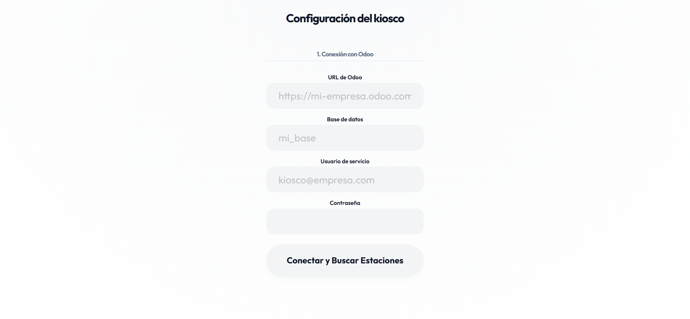
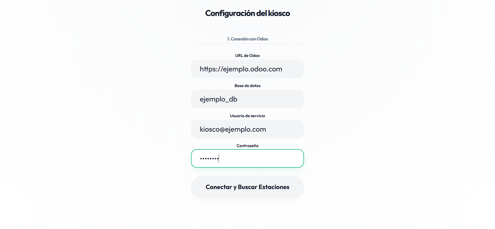
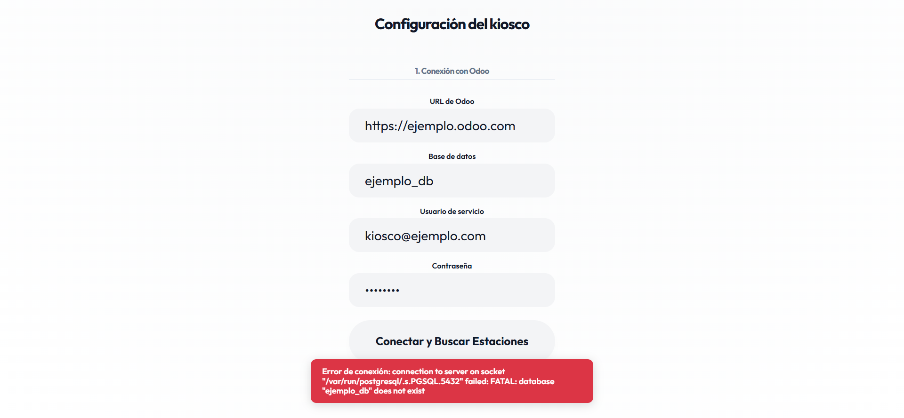
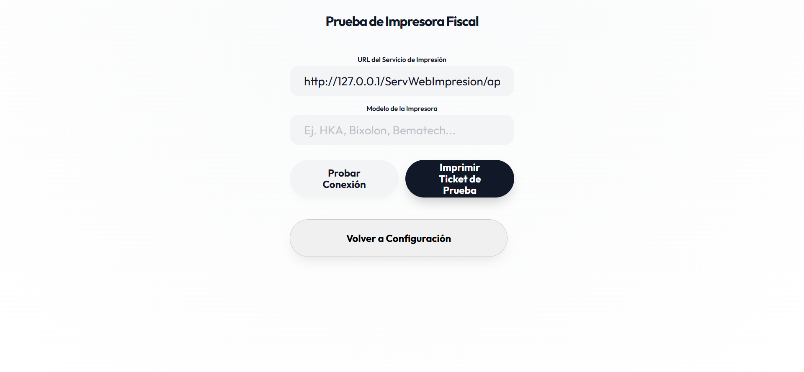

# Configuración del Kiosco (`/setup`)

Ruta: `/setup` — componente `src/features/setup/pages/Setup.tsx`

La pantalla de configuración se divide en dos pasos secuenciales. El paso 2 solo aparece una vez que la conexión con Odoo fue verificada.

---

## Paso 1 — Conexión con Odoo

Campos requeridos:

| Campo | Descripción |
|---|---|
| URL de Odoo | URL de la instancia (ej. `https://mi-empresa.odoo.com`) |
| Base de datos | Nombre de la base de datos Odoo |
| Usuario de servicio | Usuario con el que el kiosco se autentica contra Odoo |
| Contraseña | Contraseña del usuario de servicio |

Al hacer clic en **"Conectar y Buscar Estaciones"**:

1. Se guarda la URL como target del proxy local (`/__odoo-proxy-target`).
2. Se llama a `odooEnv.setupConnection()` y luego `odooEnv.authenticate()`.
3. Si la autenticación falla, se muestra un toast de error y el botón permanece sin verificar.
4. Si es exitosa, el botón cambia a **"✓ Conexión Verificada"** y se revela el Paso 2.

> No se pudo capturar el estado exitoso ni el Paso 2 porque requieren credenciales reales de una instancia Odoo — no se usaron datos reales por seguridad. El comportamiento del Paso 2 se documenta a continuación en base al código (`Setup.tsx` líneas 114-147).

---

## Paso 2 — Vincular Estación (visible solo tras conexión exitosa)

Campos:

| Campo | Descripción |
|---|---|
| Token de configuración | Token generado en Odoo, válido por 30 minutos |
| URL impresora fiscal | Endpoint del servicio de impresión (default `http://127.0.0.1/ServWebImpresion/api/`) |
| Modelo impresora fiscal | Ej. HKA, Bixolon, Bematech |
| PIN de administrador | Mínimo 4 dígitos, se guarda hasheado (SHA-256) |

Botón **"Probar conexión"** navega a `/test-printer` sin perder los datos ya ingresados (quedan en el store).

Al hacer clic en **"Guardar y Finalizar"** (`saveConfig` en `src/shared/stores/config.ts`):

1. Hashea el PIN (SHA-256) y genera un `appToken` (UUID).
2. Reconfigura el proxy y re-autentica contra Odoo.
3. Descarga el logo de la empresa (`fetchCompanyLogo`).
4. Si hay `configToken`, llama a `linkStation()` para vincular la estación y trae `branchState` y `fixedProductIds` de la sucursal.
5. Persiste todo en `localStorage` bajo la key `autopay-config` y marca `isConfigured: true`.
6. Redirige a `/`.

Validaciones antes de guardar:
- Debe haber conexión verificada (`isConnected`).
- El token de configuración no puede estar vacío.
- El PIN debe tener al menos 4 dígitos.

---

## Pantalla auxiliar — Prueba de Impresora Fiscal (`/test-printer`)

Componente: `src/features/setup/pages/PrinterTest.tsx`

- **Probar Conexión**: instancia `FiscalPrinterAdapter` y llama a `checkConnection()`.
- **Imprimir Ticket de Prueba**: envía una factura de prueba mínima (`printFactura`) con datos ficticios (documento `V999999999`, monto 10).
- **Volver a Configuración**: regresa a `/setup` sin perder los valores de URL/modelo (quedan en el store por defecto).

⚠️ El botón "Imprimir Ticket de Prueba" envía una impresión real si el servicio está activo — no se ejecutó durante esta documentación.
